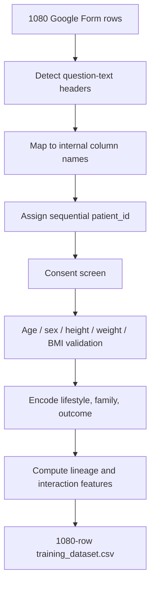

# DESCEND Survey Cleaning for Model Training

This document records how the DESCEND Google Form export is checked, mapped, and transformed into the respondent-level CSV used by `train.py`. It is intended for the thesis methodology chapter and for reproducing the processed file.

DESCEND is educational and non-diagnostic. Survey answers and the processed `outcome` column are self-reported research labels, not physician-confirmed diagnoses.

Related docs: [Google Form field inventory](GOOGLE_FORM_FIELD_INVENTORY.md), [ML validation plan](ML_VALIDATION_AND_DOCUMENTATION_PLAN.md), [Risk scoring](RISK_SCORING.md).

## 1. Files and how to reproduce

| Role | Path |
|---|---|
| Current Google Form export (workbook) | `Backend/ml/datasets/raw/DESCEND — Type 2 Diabetes Risk Awareness Survey  (Responses).xlsx` |
| Current Google Form export (CSV used by the pipeline) | `Backend/ml/datasets/raw/DESCEND RAW SURVEY (Responses).csv` |
| Earlier 900-row export (kept for provenance) | `Backend/ml/datasets/raw/DESCEND RAW SURVEY.csv` |
| Canonical training CSV | `Backend/ml/datasets/processed/training_dataset.csv` |
| Named 900-row snapshot | `Backend/ml/datasets/processed/training_dataset_descend_900.csv` |
| Named 1080-row snapshot (current train file) | `Backend/ml/datasets/processed/training_dataset_descend_responses_1080.csv` |
| Prior 488-row artifact | `Backend/ml/datasets/processed/training_dataset_filipino_488.csv` |

The 1080-row `(Responses)` export supersedes the earlier local augmentation step. It contains the original 900 responses **unchanged** plus 180 additional collected responses covering the previously missed positive profiles, so no synthetic noise or synthetic boundary rows are added on top of it.

**Scripts**

| Script | Role |
|---|---|
| `Backend/scripts/clean_raw_to_training.py` | Clean original or resolved raw CSV |
| `Backend/scripts/gform_survey_map.py` | Detect Google Form headers; map questions to internal names |
| `Backend/scripts/prepare_training_dataset.py` | Validate rows; encode features; write training CSV |
| `Backend/scripts/dataset_paths.py` | Prefer the live `(Responses)` export when present |
| `Backend/train.py` | Train ExtraTrees; default threshold is recall-constrained |
| `Backend/tests/test_gform_survey_map.py` | Mapping, activity/diet encoding, and end-to-end prepare tests |
| `Backend/tests/test_threshold_selection.py` | Screening threshold selection |

From `Backend/`:

```bash
python scripts/clean_raw_to_training.py
python train.py
```

Optional paths:

```bash
python scripts/clean_raw_to_training.py --raw ml/datasets/raw/DESCEND RAW SURVEY.csv --out ml/datasets/processed/training_dataset.csv
```

The cleaner detects question-text headers automatically. Rows that fail validation are **skipped entirely** (not imputed).

## 2. Raw export profile

Checked 2026-08-29 on `DESCEND RAW SURVEY (Responses).csv`.

| Item | Result |
|---|---|
| Format | Google Sheets / Forms export, UTF-8 |
| Rows | 1080 |
| Columns | 39 (timestamp + 38 answer fields) |
| Composition | 900 rows identical to the earlier export + 180 newly collected responses |
| Consent | 1080 `I agree`; 0 refusals |
| Exact duplicate responses (excluding timestamp) | 0 |
| Duplicate timestamps | 0 |
| Required demographics (sex, age, height, weight) | 0 missing |
| Family status and aunt/uncle counts | 0 missing |
| Optional fasting glucose filled | 473 / 1080 (43.8%) |
| Optional HbA1c filled | 427 / 1080 (39.5%) |
| Respondent diagnosis age filled | 400 / 1080 (only the diagnosed group) |

### 2.1 Raw label and demographics

| Item | Count |
|---|---:|
| Doctor-diagnosed T2DM = Yes | 400 |
| Doctor-diagnosed T2DM = No | 680 |
| Female | 595 |
| Male | 485 |
| Age | 18–77 years |
| Height | 143–177 cm |
| Weight | 37–109 kg |
| Computed BMI | 17.31–37.72 |
| Diagnosed age among Yes respondents | none missing; none greater than current age |

Hypertension: 668 No, 273 Yes, 139 I'm not sure.

### 2.2 The 180 newly collected responses

All 180 are doctor-diagnosed T2DM = Yes, and they deliberately cover the profiles the earlier model missed: age 28–65 (mean 48.5), BMI 20.9–28.3 (mean 24.9, i.e. mostly non-obese), 119 / 180 without hypertension, and 130 / 180 reporting at least two affected grandparents. They raise the positive rate from 24.4% to 37.0%.

The form does not include a mother-GDM question. That training column is filled as unknown (`0.35`) for every row and is **not** an ExtraTrees feature.

## 3. Raw quality checks

Plausibility ranges are those in `prepare_training_dataset.py`.

| Check | Threshold | Failures |
|---|---|---:|
| Consent refused | `I agree` / Yes required | 0 |
| Age | 12–110 years | 0 |
| Height | 100–230 cm | 0 |
| Weight | 28–280 kg | 0 |
| BMI | 12–65 | 0 |
| Sex | Male or Female | 0 |
| Blank required answer fields | sex, age, height, weight, hypertension, lifestyle, family status, aunt/uncle counts | 0 |
| Diagnosis age vs current age | diagnosis age ≤ age when diagnosed = Yes | 0 |
| Diagnosis age present when diagnosed = No | must be empty | 0 |

Optional blanks (glucose, HbA1c, relative diagnosis ages, earliest aunt/uncle ages) are expected and are not used as ExtraTrees columns.

## 4. Cleaning flowchart



| Stage | Rows remaining | Removed |
|---|---:|---:|
| Raw export | 1080 | — |
| Consent | 1080 | 0 |
| Demographic and BMI validation | 1080 | 0 |
| Duplicate responses | 1080 | 0 |
| Final training CSV | 1080 | 0 |

## 5. Google Form → internal schema

`gform_survey_map.py` matches headers after lowercasing and collapsing whitespace. Detection uses any of: consent question, doctor-diagnosis question, height-in-centimeters question.

| Google Form question | Internal field |
|---|---|
| Do you agree to participate in this study? | `consent` (`1` / `0`) |
| Has a doctor diagnosed you with Type 2 diabetes? | `patient_has_t2dm_status` |
| At what age were you diagnosed? | `age_at_diagnosis` |
| What is your sex? | `sex_at_birth` |
| What is your age? | `age` |
| What is your height in centimeters? | `height_cm` |
| What is your weight in kilograms? | `weight_kg` |
| Have you been told you have hypertension…? | `self_hypertension_status` |
| Fasting blood glucose (optional) | `fasting_glucose_mg_dl` |
| HbA1c (optional) | `hba1c_percent` |
| Usual physical activity level | `physical_activity_level` |
| Exercise frequency in a typical week | `physical_activity_frequency` |
| Typical exercise session length | `exercise_duration` |
| Sugary drinks | `sugary_drink_frequency` |
| Fast food | `fast_food_frequency` |
| Smoking / alcohol / sleep | kept on the mapped row; not ExtraTrees features |
| Father / mother / four grandparents T2DM | `*_t2dm_count_raw` (Yes / No / I'm not sure) |
| Sibling T2DM | `sibling_t2dm_status` → `siblings_t2dm_count_raw` |
| Maternal uncles + maternal aunts counts | summed → `maternal_aunts_uncles_t2dm_count_raw` |
| Paternal uncles + paternal aunts counts | summed → `paternal_aunts_uncles_t2dm_count_raw` |

`patient_id` is not on the Google Form. Each kept row receives a sequential id `1`…`1080`, copied to `source_patient_id` and `source_record_id`.

## 6. Feature encoding

### 6.1 Outcome (`outcome`)

| Raw doctor diagnosis | Training label |
|---|---|
| Yes | 1 |
| No | 0 |

This export has no `I'm not sure` diagnosis answers, so no unknown-outcome rows were dropped. Labels remain self-reported.

### 6.2 Demographics

- `user_is_male`: Male → `1.0`, Female → `0.0`
- `bmi`: `weight_kg / (height_cm / 100)^2`, rounded to 2 decimals

### 6.3 Hypertension and unknown family status

Yes / No / I'm not sure map to `1.0` / `0.0` / `0.35`. The same coding is used for parents and grandparents. `parent_has_t2dm` is the maximum of father and mother scores.

### 6.4 Physical activity (`physical_activity_score`, model scale 0–2)

Encoding prefers **exercise frequency**, then falls back to **usual activity level**, matching the DESCEND app payload mapper.

| Exercise frequency | Score |
|---|---:|
| Daily, or 4–5 times a week | 2.0 |
| Once a week, or 2–3 times a week | 1.0 |
| Never, and level is sedentary / low | 0.0 |
| Never, and level is light / moderate / very or extremely active | 1.0 |

Processed counts: 18 low (`0.0`), 590 moderate (`1.0`), 292 high (`2.0`).

### 6.5 Diet (`diet_quality_score`, model scale 0–2)

The Google Form has no single diet-quality item. The cleaner derives it from sugary-drink and fast-food frequency:

| Rule | Label | Score |
|---|---|---:|
| Either item is Daily or Often (a few times a week) | unhealthy | 0.0 |
| Otherwise either item is Sometimes (a few times a month) | mixed | 1.0 |
| Otherwise (Rarely / Never) | healthy | 2.0 |

Processed counts: 392 unhealthy, 353 mixed, 155 healthy.

`diet_quality_score` is written to the training CSV for completeness. It is **not** in the ExtraTrees `FEATURE_COLUMNS` list. At inference, sugary-drink and fast-food answers still enter the post-model lifestyle adjustment ([Risk scoring](RISK_SCORING.md)).

### 6.6 Siblings and aunts/uncles

| Raw | Training |
|---|---|
| Sibling = Yes | `siblings_diabetes_count` = 1, `siblings_score` = 1 |
| Sibling = No or I'm not sure | count 0, score 0 |
| Aunt/uncle counts | integer sum of maternal uncles + aunts + paternal uncles + aunts |
| Any aunt/uncle count > 0 | `aunts_uncles_score` = 1 |

I'm not sure on sibling status does not invent a diabetic sibling. That matches the live app (`siblingsDiabetesCount` is 1 only when the answer is yes).

### 6.7 Lineage and interaction features

Family Yes/No/unknown values are passed to `derive_family_metrics` (same functions used at prediction time):

- `weightedFamilyScore`, `maternalScore`, `paternalScore`
- `firstDegreeYesCount`, `secondDegreeYesCount`, `diabeticRelativesCount`
- `lineageRiskIndex`, `propagationProbability`

Interaction terms:

- `metabolic_risk_index` = `age * (bmi / 24)`
- `hereditary_load_index` = blend of parental T2DM, first/second-degree counts, weighted family score, sibling count, and aunt/uncle score
- `activity_metabolic_index` = `physical_activity_score * (1 + hypertension_status)`

Respondent-level training rows use placeholder target fields `generation_depth = 1.5` and `target_is_male = 0.5`, with `target_label = respondent`. Child-scenario scoring is applied only at inference.

## 7. Processed training file

### 7.1 Class distribution

| Outcome | Definition | Count | Percentage |
|---|---|---:|---:|
| 0 | No self-reported doctor diagnosis | 680 | 75.56% |
| 1 | Self-reported doctor diagnosis of T2DM | 220 | 24.44% |

Compared with the prior 488-row file (290 positive / 198 negative), this set is larger and more negative-class dominant. Retraining on it will change class balance and should be re-evaluated with grouped cross-validation before replacing the deployed model.

### 7.2 Columns written

```
age, bmi, user_is_male, physical_activity_score, diet_quality_score,
parent_has_t2dm, hypertension_status, mother_gdm_during_index_pregnancy,
siblings_score, aunts_uncles_score, siblings_diabetes_count,
aunts_uncles_diabetes_count, weightedFamilyScore, maternalScore, paternalScore,
firstDegreeYesCount, secondDegreeYesCount, diabeticRelativesCount,
lineageRiskIndex, propagationProbability, metabolic_risk_index,
hereditary_load_index, activity_metabolic_index, generation_depth,
target_is_male, outcome, source_record_id, source_patient_id, target_label
```

ExtraTrees training uses only `FEATURE_COLUMNS` in `Backend/descend/ml/modeling.py`. Grouped splits use `source_patient_id`.

### 7.3 Fields kept on the raw file but not ExtraTrees inputs

Smoking, alcohol, sleep, exercise duration, optional glucose/HbA1c, and relative diagnosis ages are available on the raw export and in the live assessment payload. They affect the **soft-adjustment** layer after the tree model, not the ExtraTrees feature vector.

## 8. Limitations

1. Outcome is self-reported doctor diagnosis, not a lab-confirmed or chart-verified label.
2. Each row is one respondent; `source_patient_id` is a sequential survey id, not a multi-member family id. Grouped CV therefore does not test family-level generalization.
3. Sex is Male/Female only, as on the form.
4. Sibling history is a yes/no item, not a count of diabetic siblings.
5. Mother GDM was not asked; the column is a constant unknown value.
6. Optional labs are missing for most respondents and must not be described as complete clinical workups.
7. ExtraTrees does not include mother GDM (not asked on the form), so young-female rows teach mother T2DM in young women, not a GDM coefficient.
8. The 180 added responses are all positives targeted at known blind spots. That is useful for recall but it makes the sample's positive rate (37.0%) unrepresentative of population prevalence, so precision and PR-AUC here should not be read as population estimates.
9. Hold-out metrics on the 1080-row file are not comparable one-to-one with earlier 900-row or locally augmented runs; the test split differs.

## 9. Relationship to the 488-row Filipino artifact

| | Google Form 1080 | Prior Filipino 488 |
|---|---|---|
| Raw file | `DESCEND RAW SURVEY (Responses).csv` | `training_dataset_filipino_488.csv` (processed); original workbook documented in the ML plan |
| Processed rows | 1080 | 488 |
| Rows dropped | 0 | 12 unknown `outcome = 99` |
| T2DM / not T2DM | 400 / 680 | 290 / 198 |
| Header style | Google Form question text | Internal column names |
| Current `training_dataset.csv` | This file | Replaced as the canonical train path |

Keep `training_dataset_filipino_488.csv` so that artifact can still be reproduced. Do not mix the two CSVs in one training run without documenting the merge.

## 10. Screening coverage and operating threshold

Earlier revisions of this document described a local augmentation script that added synthetic noise and 180 synthetic boundary rows. That step has been **removed**: the live form now supplies 180 real responses covering the same missed-positive profiles (see §2.2), so the pipeline trains directly on the export with no synthetic rows.

`python train.py` defaults to **recall-constrained** threshold selection (not F1):

- Require **recall ≥ 0.82**
- Prefer **precision ≥ 0.70** inside **0.45–0.58**
- If that band cannot hit the recall floor, search down to 0.20
- Among feasible cutoffs, pick the **highest** threshold (as few extra false positives as possible)

Rationale for the thesis: this is a screening-style awareness tool, so missed positives are costlier than extra false positives. The displayed percentage is still the calibrated probability; the cutoff is the binary operating point used in CV/hold-out confusion matrices.

Retrain (2026-08-29) on the 1080-row `(Responses)` export: ExtraTrees, operating cutoff **0.58**.

| Metric | 5-fold CV (mean ± std) | Hold-out |
|---|---|---|
| ROC-AUC | 95.45% ± 0.68% | 97.26% |
| PR-AUC | 92.89% ± 1.07% | 96.06% |
| Recall | 86.00% ± 0.50% | 90.00% |
| Precision | 83.72% ± 1.58% | 87.80% |
| F1 | 84.84% ± 0.97% | 88.89% |
| Specificity | 90.15% ± 1.10% | 92.65% |
| Accuracy | 88.61% ± 0.81% | 91.67% |
| Brier | 0.0949 ± 0.0052 | 0.0665 |

Hold-out confusion `[[126, 10], [8, 72]]` — 8 false negatives and 10 false positives on 216 test rows. The label-shuffle sanity check returns ROC-AUC ≈ 0.47, confirming the model is not fitting label patterns.
