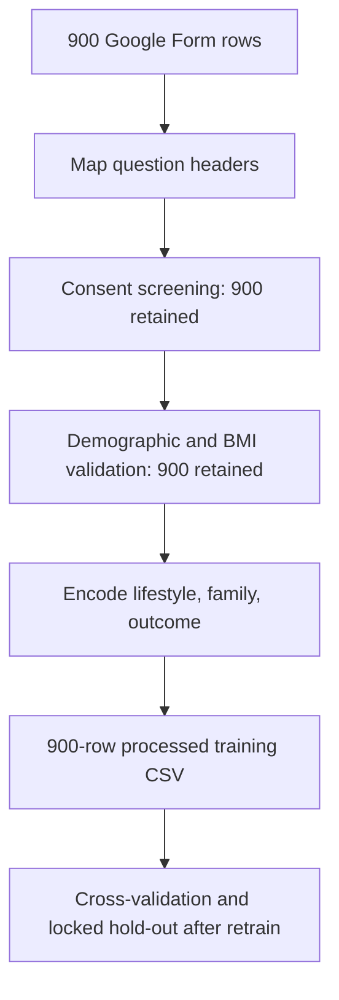
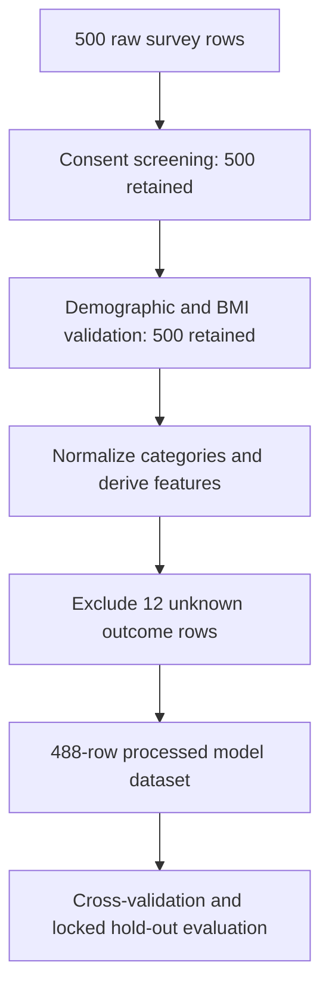

# ML Validation and Documentation Plan

## Purpose

This document records the evidence supporting DESCEND as a Filipino-focused diabetes-risk awareness tool. It is intended for the thesis methodology, results, appendices, and final defense.

DESCEND is educational and non-diagnostic. Do not present its output as a clinical diagnosis or as externally validated medical probability.

Survey cleaning, Google Form column mapping, and the 1080-row processed file are documented in [DATA_CLEANING.md](DATA_CLEANING.md).

## 1. Dataset Profile

Do not treat these artifacts as the same dataset.

| Artifact | Rows | File | Role |
|---|---:|---|---|
| Current training CSV | 1080 | `training_dataset.csv` (snapshot: `training_dataset_descend_responses_1080.csv`) | Full `DESCEND ... (Responses)` Google Form export: the earlier 900 responses unchanged plus 180 newly collected positives. No synthetic rows. ExtraTrees JSON `datasetRows: 1080`. |
| Earlier 900-row snapshot | 900 | `training_dataset_descend_900.csv` | Previous clean export, superseded. |
| Prior Filipino survey | 488 | `training_dataset_filipino_488.csv` | Historical ExtraTrees artifact. |

### 1.1 Current training CSV (1080 rows)

| Item | Verified result |
|---|---|
| Raw source | `DESCEND RAW SURVEY (Responses).csv` (from the `(Responses)` workbook) |
| Processed rows | 1080 (400 T2DM / 680 not), 0 dropped |
| Operating threshold | 0.58, recall-constrained |
| Label quality | Self-reported doctor diagnosis throughout; no synthetic labels |
| Hold-out | Recall 90.0%, precision 87.8%, ROC-AUC 97.3%, confusion `[[126, 10], [8, 72]]` |
| Cleaning | [DATA_CLEANING.md](DATA_CLEANING.md) §10 |

### 1.1a Earlier 900-row Google Form snapshot

| Item | Verified result |
|---|---|
| Raw source file | `Backend/ml/datasets/raw/DESCEND RAW SURVEY.csv` |
| Raw rows / columns | 900 rows, 39 columns |
| Processed rows | 900 (0 dropped) |
| Processed files | `training_dataset_descend_900.csv` |
| Age range | 18–77 years |
| Sex coding | 421 male (46.78%), 479 female (53.22%) |
| Outcome | 220 T2DM (24.44%), 680 not T2DM (75.56%) |
| Collection timestamps | 2024-01-05 to 2025-08-20 |
| Label quality | Self-reported doctor diagnosis; not physician-verified in project files |
| Cleaning methodology | [DATA_CLEANING.md](DATA_CLEANING.md) |

### 1.1b Prior 488-row model dataset (historical ExtraTrees)

| Item | Verified result |
|---|---|
| Raw source file | `Backend/ml/datasets/raw/raw dataset.xlsx` |
| Raw worksheet | `Dataset` |
| Raw rows | 500 |
| Raw columns | 31 |
| Processed model rows | 488 |
| Processed model file | `Backend/ml/datasets/processed/training_dataset_filipino_488.csv` |
| Raw rows excluded from processed artifact | 12 rows with `outcome = 99` |
| Raw patient IDs | 500 distinct IDs |
| Processed patient IDs | 488 distinct IDs |
| Processed age range | 18-77 years |
| Processed sex coding | 224 male-coded (45.90%), 264 female-coded (54.10%) |
| Filipino representation | The file and model documentation identify a Filipino family-lineage T2DM survey; geographic coverage requires confirmation from the original study records |
| Collection method/date | Not recorded in the model artifact; obtain from the original survey documentation |
| Label quality | Derived from the respondent T2DM status/outcome fields; physician verification is not established in the project files |

### 1.2 Class distribution — 900-row Google Form training CSV

| Outcome | Definition | Count | Percentage |
|---|---|---:|---:|
| 0 | No self-reported doctor diagnosis | 680 | 75.56% |
| 1 | Self-reported doctor diagnosis of T2DM | 220 | 24.44% |

### 1.2b Class distribution — prior 488-row model file

| Outcome | Definition | Count | Percentage |
|---|---|---:|---:|
| 0 | No T2DM outcome | 198 | 40.57% |
| 1 | T2DM outcome | 290 | 59.43% |
| Unknown raw outcome | `outcome = 99`; absent from processed model file | 12 raw rows | 2.40% of raw rows |

The prior raw workbook also contains 225 rows with `patient_has_t2dm_status = 0`, 180 with `= 1`, and 95 with `= 99`. Reconcile these respondent-status values with the final `outcome` labels before claiming that the label is clinically confirmed.

### 1.3 Raw data-quality findings — 900-row Google Form export

| Check | Raw result |
|---|---:|
| Blank required data rows | 0 |
| No-consent rows | 0 |
| Age outside 12–110 | 0 |
| Height outside 100–230 cm | 0 |
| Weight outside 28–280 kg | 0 |
| BMI outside 12–65 | 0 |
| Invalid sex values | 0 |
| Exact duplicate responses | 0 |
| Diagnosed respondents missing diagnosis age | 0 |

Prior 488-row workbook checks (for the deployed model dataset):

| Check | Raw result |
|---|---:|
| Blank data rows | 0 |
| No-consent rows | 0 |
| Invalid patient IDs | 0 |
| Age outside configured range 12-110 | 0 |
| Height outside configured range 100-230 cm | 0 |
| Weight outside configured range 28-280 kg | 0 |
| BMI outside configured range 12-65 | 0 |
| Invalid sex values | 0 |
| Duplicate patient IDs | 0 |
| Unknown cells across six primary family fields | 315 |
| Contradictory responses | Not yet assessed |

### 1.4 Label-quality statement

> For the 900-row Google Form file, `outcome` is the self-reported answer to “Has a doctor diagnosed you with Type 2 diabetes?” (Yes = 1, No = 0). No unknown diagnosis answers were present, and no rows were dropped. For the prior 488-row artifact, twelve raw records coded as unknown (`outcome = 99`) are absent from that processed CSV. In both cases the project files do not establish physician verification. The target should be interpreted as a dataset outcome rather than a definitive clinical diagnosis. This limits the interpretation of model performance and prevents the deployed score from being presented as a medical diagnosis.

## 2. Data-Cleaning Flowchart

Current Google Form pipeline (see [DATA_CLEANING.md](DATA_CLEANING.md)):

Prior 488-row artifact (deployed model):

### 2.1 Cleaning-stage counts

Google Form export (`DESCEND RAW SURVEY.csv`):

| Cleaning stage | Rows remaining | Rows removed | Evidence |
|---|---:|---:|---|
| Raw CSV | 900 | — | 39-column Google Form export |
| Consent screening | 900 | 0 | All rows `I agree` |
| Demographic validation | 900 | 0 | No invalid age, height, weight, BMI, or sex |
| Duplicate checking | 900 | 0 | No exact duplicate responses |
| Final training CSV | 900 | 0 | `training_dataset.csv` |

Prior workbook (`raw dataset.xlsx`), still the source of the 488-row deployed-model file:

| Cleaning stage | Rows remaining | Rows removed | Evidence |
|---|---:|---:|---|
| Raw workbook | 500 | - | `raw dataset.xlsx`, Dataset sheet |
| Consent screening | 500 | 0 | No consent exclusions detected |
| Demographic validation | 500 | 0 | No invalid age, height, weight, BMI, or sex values detected |
| Duplicate checking | 500 | 0 | No duplicate patient IDs detected |
| Outcome verification | 488 | 12 | `outcome = 99` rows absent from processed CSV |
| Final model dataset | 488 | - | `training_dataset_filipino_488.csv` |

## 3. Feature Mapping

| Questionnaire item | Input field | Encoded feature or output | Processing | Layer |
|---|---|---|---|---|
| Age | `personalInfo.age` | `age` | Numeric validation | ExtraTrees |
| Height and weight | `heightCm`, `weightKg` | `bmi` | `weightKg / (heightCm / 100)^2` | ExtraTrees and structural blend |
| Parent T2DM history | `familyHistory.mother/father` | `parent_has_t2dm` | Maximum parent status score | ExtraTrees |
| Grandparent T2DM history | Family-history fields | `weightedFamilyScore`, `lineageRiskIndex` | Distance-weighted lineage graph | ExtraTrees and structural blend |
| Sibling diabetes count | `siblingsDiabetesCount` | `siblings_diabetes_count` | Non-negative, bounded count | ExtraTrees and lineage layer |
| Aunt/uncle diabetes count | Aunt/uncle fields | `aunts_uncles_score`, count | Count/status mapping | ExtraTrees and lineage layer |
| Hypertension | `diagnosedHypertension` | `hypertension_status` | Yes/no/unknown mapping, including parental blend | ExtraTrees and structural blend |
| Exercise frequency | `physicalActivityScore` and lifestyle fields | `physical_activity_score` | Survey 1-4 mapped to model 0-2 | ExtraTrees and soft adjustment |
| Fasting glucose | `fastingGlucoseMgDl` | Blood delta | Range-based adjustment | Post-model heuristic |
| HbA1c | `hba1cPercent` | Blood delta | Range-based adjustment | Post-model heuristic |
| Diagnosis ages | `diagnosisAges` | Early-onset delta | Age-based adjustment | Post-model heuristic |
| Smoking, alcohol, sleep | Lifestyle fields | Lifestyle deltas | Hand-selected adjustments | Post-model heuristic |

Glucose, HbA1c, diagnosis ages, smoking, alcohol, sleep, and detailed diet inputs are not ExtraTrees feature columns in the tracked model. They affect later heuristic or recommendation layers.

### 3.1 Feature redundancy

The lineage variables `parent_has_t2dm`, `weightedFamilyScore`, `lineageRiskIndex`, `propagationProbability`, and `hereditary_load_index` encode overlapping family-history information. Conduct ablation experiments comparing demographic/BMI-only, family-only, metabolic-only, all-feature, and no-composite versions. Report changes in discrimination and calibration.

## 4. Model Validation Snapshot

### 4.1 Current ExtraTrees artifact (1080-row screening train, 2026-08-29)

ExtraTrees, 400 estimators, max depth 6, min leaf 3, `class_weight=balanced`, seed 42. Threshold strategy: **recall-constrained** (recall ≥ 0.82, prefer precision ≥ 0.70, preferred band 0.45–0.58).

| Metric | Cross-validation | Locked hold-out |
|---|---:|---:|
| ROC-AUC | 0.9545 | 0.9726 |
| PR-AUC | 0.9289 | 0.9606 |
| Brier score | 0.0949 | 0.0665 |
| Recall | 0.8600 | 0.9000 |
| Precision | 0.8372 | 0.8780 |
| F1 score | 0.8484 | 0.8889 |
| Specificity | 0.9015 | 0.9265 |
| Accuracy | 0.8861 | 0.9167 |
| Confusion matrix | — | `[[126, 10], [8, 72]]` |
| Operating threshold | 0.58 (OOF/train) | 0.58 |

Label-shuffle mean ROC-AUC ~0.47. All 1080 rows have distinct group IDs, so CV is respondent-level, not family-level. Because the 180 added responses are all positives targeting known blind spots, the 37.0% positive rate is not population prevalence; treat these as internal evaluation, not external validation.

### 4.2 Prior 488-row artifact (historical)

Trained 2026-08-24, F1 threshold. Do not mix with the table above.

| Metric | Cross-validation | Locked hold-out |
|---|---:|---:|
| ROC-AUC | 0.9974 | 0.9931 |
| PR-AUC | 0.9982 | 0.9951 |
| Brier score | 0.0189 | 0.0294 |
| Recall | 0.9828 | 0.9828 |
| Confusion matrix | - | `[[37, 3], [1, 57]]` |
| Operating threshold | - | 0.515 |

The label-shuffle diagnostic produced ROC-AUC 0.5583. Unusually high 488-row metrics should be presented cautiously (label, duplicate-feature, sampling, and target-construction effects).

## 5. Expert Validation Questionnaire

Use a 1-4 scale:

- 1 = inappropriate or unclear
- 2 = major revision needed
- 3 = acceptable with minor revision
- 4 = highly appropriate

| Component | Relevant 1-4 | Clear 1-4 | Safe 1-4 | Filipino-appropriate 1-4 | Comments |
|---|---:|---:|---:|---:|---|
| Age question |  |  |  |  |  |
| Height and weight questions |  |  |  |  |  |
| Family-history questions |  |  |  |  |  |
| Hypertension questions |  |  |  |  |  |
| Physical-activity questions |  |  |  |  |  |
| Diet questions |  |  |  |  |  |
| Laboratory questions |  |  |  |  |  |
| Diagnosis-status question |  |  |  |  |  |
| Risk-band explanation |  |  |  |  |  |
| Recommendations |  |  |  |  |  |
| Non-diagnostic disclaimer |  |  |  |  |  |
| Child-scenario wording |  |  |  |  |  |
| English and Tagalog translation |  |  |  |  |  |

Ask reviewers whether the questions and rules are relevant, clear, safe, and appropriate for an awareness tool. Do not ask them to certify the output as medically accurate.

## 6. Reviewers

Expert validation is not documented in the current project files. Complete this table only after obtaining real reviews.

| Reviewer ID | Qualification | Years of experience | Expertise | Validation role |
|---|---|---:|---|---|
| Reviewer 1 | [Actual qualification] | [Years] | Endocrinology or diabetes care | Features, formulas, and scoring |
| Reviewer 2 | [Optional qualification] | [Years] | Diabetes education or primary care | Recommendations and safety |
| Reviewer 3 | [Optional qualification] | [Years] | Public health, nutrition, or Filipino health communication | Cultural relevance and wording |

Preserve completed forms or signed review records, subject to ethics and privacy requirements.

## 7. Content Validity Index

An item is relevant when rated 3 or 4:

$$
I\text{-}CVI =
\frac{\text{Number of reviewers rating the item 3 or 4}}
{\text{Total number of reviewers}}
$$

$$
S\text{-}CVI/Ave =
\frac{\sum I\text{-}CVI}{\text{Number of items}}
$$

| Item | Reviewers rating 3 or 4 | Total reviewers | I-CVI | Decision |
|---|---:|---:|---:|---|
| Age question | Pending | Pending | Pending | Retain / revise / remove |
| BMI inputs | Pending | Pending | Pending | Retain / revise / remove |
| Family-history questions | Pending | Pending | Pending | Retain / revise / remove |
| Risk-band wording | Pending | Pending | Pending | Retain / revise / remove |
| Recommendations | Pending | Pending | Pending | Retain / revise / remove |

Overall S-CVI/Ave: **Pending expert review**

CVI supports content relevance. It does not establish diagnostic accuracy, calibration, or clinical effectiveness.

## 8. Formula Review

| Formula or rule | Current implementation | Expert decision | Required change | Status |
|---|---|---|---|---|
| BMI | Weight divided by height in meters squared | Pending | Confirm units and interpretation | Implemented; review pending |
| Unknown family history | Status value 0.35 | Pending | Review uncertainty treatment | Implemented; review pending |
| Weighted family score | Relative status divided by family distance | Pending | Review weights | Implemented; review pending |
| Lineage risk index | Weighted lineage components | Pending | Review overlap and weights | Implemented; review pending |
| Propagation probability | Multiplicative heuristic | Pending | Confirm non-clinical wording | Implemented; review pending |
| Hereditary load index | Lineage strength plus extended-family factor | Pending | Review possible double-counting | Implemented; review pending |
| Hypertension blend | Personal plus parental contributions | Pending | Confirm contribution and terminology | Implemented; review pending |
| Lifestyle adjustment | Hand-selected deltas | Pending | Review safety and false precision | Implemented; review pending |
| Blood-marker adjustment | Glucose and HbA1c deltas | Pending | Add professional-care guidance | Implemented; review pending |
| Risk bands | Low below 0.34, Moderate 0.34-0.66, High at least 0.67 | Pending | Confirm awareness-only use | Implemented; review pending |

## 9. Before-and-After Revision Log

| Area | Original implementation | Expert recommendation | Revised implementation | Evidence/version |
|---|---|---|---|---|
| Risk wording | Risk probability | Avoid diagnostic interpretation | Awareness score | [Complete after review] |
| Child output | Child risk percentage | Clarify heuristic nature | Illustrative scenario | [Complete after review] |
| HbA1c result | Score adjustment only | Add referral guidance | Score plus care message | [Complete after review] |
| Unknown answers | Fixed numeric encoding | Explain uncertainty | Uncertainty note | [Complete after review] |
| Recommendations | General advice | Add Filipino context | Revised bilingual advice | [Complete after review] |
| Risk bands | Operational percentage bands | Confirm educational use | Retained with disclaimer | [Complete after review] |

## 10. Validation Scenarios

| Scenario | Review focus | Result |
|---|---|---|
| Low family history and normal BMI | Low-score wording and reassurance | Pending review |
| Strong parental T2DM history | Lineage explanation | Pending review |
| High BMI and hypertension | Recommendation safety | Pending review |
| Prediabetes-range fasting glucose | Referral guidance | Pending review |
| HbA1c at or above diagnostic range | Professional consultation message | Pending review |
| Already diagnosed respondent | Management guidance instead of prediction | Pending review |
| Unknown or incomplete answers | Uncertainty disclosure | Pending review |
| Malformed API payload | Input rejection and privacy protection | Current deployment accepts a malformed payload; revise and retest |

## 11. Limitations

- The current training CSV contains 900 Google Form rows; the deployed ExtraTrees JSON may still report 488 rows until retraining.
- The prior artifact contains 488 processed rows from a 500-row raw workbook (12 unknown outcomes excluded).
- The data appears to come from Filipino-focused survey sources; geographic coverage still needs confirmation from study records.
- Label verification by physicians is not established in the project files.
- The 900-row export has no unknown diagnosis answers; labels remain self-reported.
- The processed dataset has one distinct group ID per row, so family-level generalization is not demonstrated.
- The very high validation metrics may reflect target construction, sampling, or redundant features.
- Family-history composite features overlap and may amplify the same signal.
- Structural, lifestyle, laboratory, and child-scenario adjustments are heuristic.
- Risk bands are operational communication thresholds, not clinical thresholds.
- The system has no independent external validation cohort.
- Missing or unknown answers may affect the awareness score.
- The system does not replace physician assessment or laboratory diagnosis.

## 12. Future Work

1. Retrain used the full 1080-row `(Responses)` export with recall-constrained threshold 0.58. Keep `training_dataset_descend_900.csv` and `training_dataset_filipino_488.csv` for reproduction of earlier artifacts.
2. Confirm label provenance and obtain physician-confirmed labels where possible.
3. Collect a larger, multi-site Filipino dataset.
4. Use real patient or family identifiers for family-level splitting.
5. Add external and prospective validation.
6. Report calibration plots, calibration slope, and observed-versus-predicted risk.
7. Run feature ablation and subgroup fairness analyses.
8. Review and simplify correlated lineage features.
9. Validate English and Tagalog wording with intended users.
10. Complete expert clinical safety and ethics review.
11. Add referral workflows for potentially abnormal glucose or HbA1c values.
12. Reassess whether illustrative child projections should remain in the system.

## 13. Suggested Defense Statement

> DESCEND is a bilingual, Filipino-focused diabetes-risk awareness tool that demonstrates structured survey processing, family-lineage feature engineering, machine-learning support, and personalized health education. Expert review is used to assess the relevance, clarity, and safety of the questionnaire, formulas, risk-band terminology, and recommendations. The system is not presented as a diagnostic instrument. Its outputs are awareness scores that require further clinical and external validation before medical use.

## 14. Required Appendix Evidence

- Dataset profile and class-distribution tables
- Raw-to-processed cleaning flowchart and counts
- Feature mapping table
- Model evaluation report and artifact metadata
- Blank expert validation questionnaire
- Completed expert review forms, where permitted
- Reviewer qualifications
- CVI calculations and results
- Formula review table
- Before-and-after revision log
- Validation scenario results
- Limitations and future-work statement
